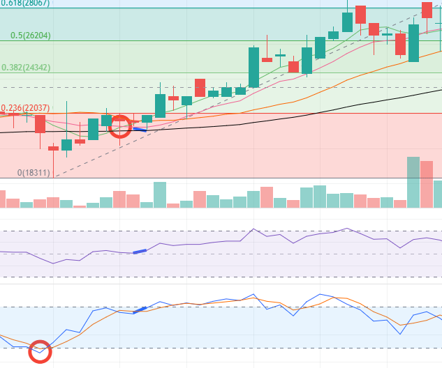
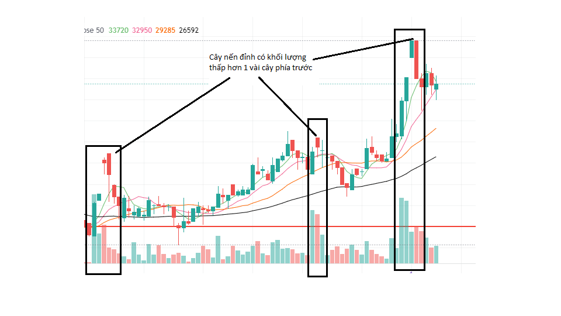

 
<h1>DGT</h1>

 Watch list - 25/9/2021 

[TOC]

## 1. Thông tin cơ bản

- Sàn: Upcom
- Ngành: DGT

## 2. Chỉ số sử dụng

- Đo fibbo, hỗ trợ, kháng cự
- Stoch
- MA: 5, 10, 20, 50 --> MA 20 làm đường hỗ trợ/kháng cự khá tốt cho đồ ngày 1D, MA 50 làm đường hỗ trợ/kháng cự khá tốt cho đồ thị 1H
- MACD (yếu)
- RSI đoạn 50 (suppo)

## 3. Chiến lược (Hiện khá ngắn hạn)

### **Mua**

Thường đường MA sẽ sớm hơn MACD. Con này đánh dài hạn nên điểm mua thường là sẽ ở ngay hỗ trợ (có thể tham khảo đường MA 20 hoặc MA 50) + Dấu hiệu oversell của Stoch. Không nên mua nếu giá dưới MA 20.

- **Giá ở ngay hỗ trợ** (nằm ở đường SMA 20 hoặc SMA 50) --> không nên mua nếu **giá đóng cửa** nằm dưới SMA 20 hoặc SMA 50
- **Stoch bị quá bán (thường sẽ mua ở điểm quá bán số 2)**
- Có dấu hiệu mua với RSI hoặc Stoch
- MA 5 cắt MA 10 từ dưới lên (thường trễ xíu)
- **Khi MACD chuyển từ đỏ sang xanh**, đường xanh dương cắt đường màu cam từ dưới lên
- Nếu giá nằm ngay đường MA 50 màu đen thì đó là hỗ trợ mạnh 
- RSI cắt từ dưới qua mức 50

 Thật ra ngay lúc Stoch bị quá bán thì đã có dấu hiệu mua rồi, tuy nhiên sẽ bị giật lắc nên tốt nhất là chỉ mua khi giá nằm trên MA 50 & MA 20 

### **Bán** 

- **RSI bị quá mua**
- **Dấu hiệu bán với RSI hoặc Stoch**
- **Giá đóng cửa nằm phía dưới đường MA 20**
- **Cây nến đỉnh có khối lượng thấp hơn 2 cây nến phía trước**
- MA 5 cắt từ trên xuống MA 10
- Thường sẽ bị bán trễ --> kiểm trả 1-2 cây nến có giá cao nhất phía trước có khối lượng tương đối lớn không, nếu phải thì nến đó là đỉnh, phải bán ngay  
- **Thường thì 2 cây nến phía trước cây nến ngay đỉnh có khối lượng lớn hơn**

## 4. Action hiện tại (14/11/2021)

- HT: 40K
- KC: 46.5K
- Mấy nay đang đụng vào hỗ trợ 40K, có dấu hiệu mua ở **Stoch, UO,** Quan sát tiếp, mất 40K bán
- Dự đoán ngày 15/11: dao động quanh mức 42.5K, min 41K, max 45.3K

