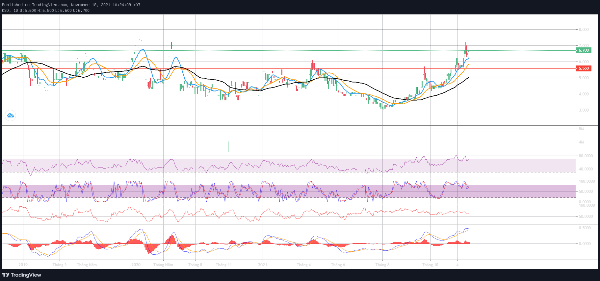
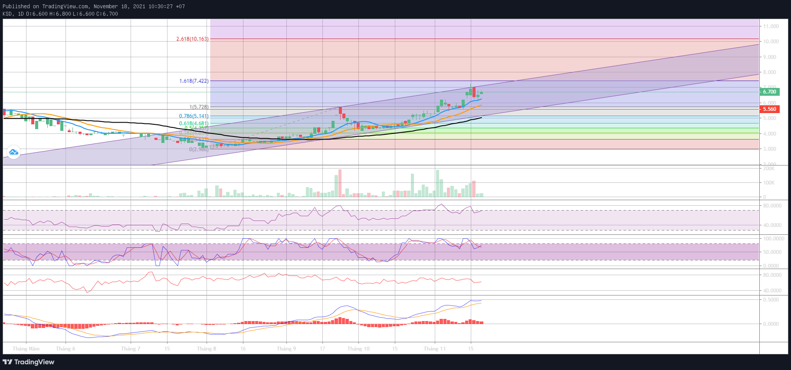

# KSD

## 1. Thông tin cơ bản

- Ngành: sản phẩm gia dụng
- Sàn: HNX
- **Volume thấp**

## 2. Chỉ số sử dụng

- MA 10, 20, 50
- Fibo thoái lui
- Kênh xu hướng

## 3. Chiến lược

### Mua

- MA 10 cắt MA 20
- Canh theo kênh xu hướng, fibo

## 4. Action plan hiện tại (18/11/2021)

- Đang trong trend tăng
- Giá mua 5.6, cắt lỗ 5.1K, target 10, khả năng cao tới 9K là gãy

