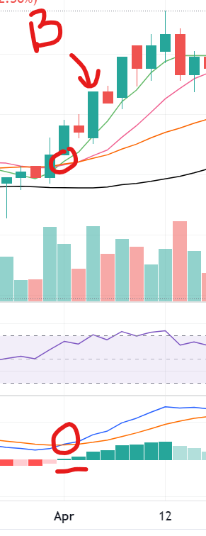
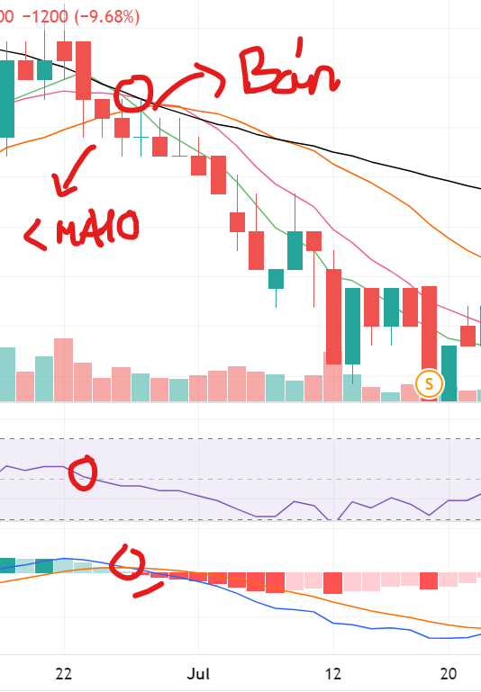
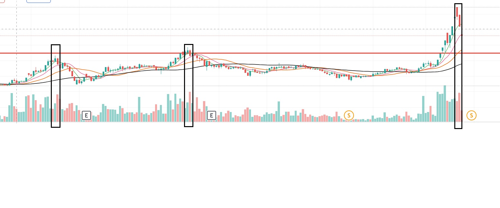
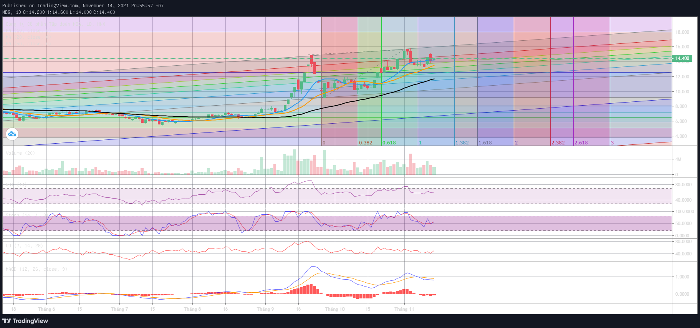

 
<h1>MBG</h1>

 Watch list - 25/9/2021 

[TOC]

## 1. Thông tin cơ bản

- Sàn: HNX
- Ngành: IT

## 2. Chỉ số sử dụng

- Đo fibbo, hỗ trợ, kháng cự
- MA: 5, 10, 20, 50
- MACD
- RSI đoạn 50 (suppo)
- Yếu không dùng: stochatic

## 3. Chiến lược (Hiện khá ngắn hạn)

### **Mua**

Sẽ bị mua trễ 1-2 cây, thường khá nhanh sẽ lên đỉnh nên lưu ý bán ngay khi giá đóng cửa dưới MA 10 & cây nến số 2 sau cây nến đỉnh có khối lượng lớn

- SMA 5 cắt từ dưới lên SMA 10
- Khi MACD chuyển từ đỏ sang xanh, đường xanh dương cắt đường màu cam từ dưới lên
- Nếu giá nằm ngay đường MA 50 màu đen thì đó là hỗ trợ mạnh 
- RSI cắt từ dưới qua mức 50
- **Không mua nếu giá ở dưới đường MA 10**

### **Bán** 

- **Giá đóng cửa nằm phía dưới đường MA 10**
- MA 5 cắt từ trên xuống MA 10
- MACD chuyển từ xanh sang đỏ, đường xanh cắt đường cam từ trên xuống
- Thường sẽ bị bán trễ --> kiểm trả 1-2 cây nến có giá cao nhất phía trước có khối lượng tương đối lớn không, nếu phải thì nến đó là đỉnh, phải bán ngay  
- **Thường thì cây nến thứ 2 sau đỉnh có khối lượng lớn hơn cây nến ngay đỉnh**

## 4. Action plan hiện tại (14/11/2021)

- KC: 15.8
- HT: 12.6
- Hiện khá gần mục tiêu 18K nên chỉ nên lướt sóng ngắn hạn thôi
- Có thể chờ hồi về 12.5K - 13K thì mua

