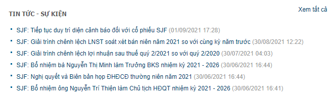
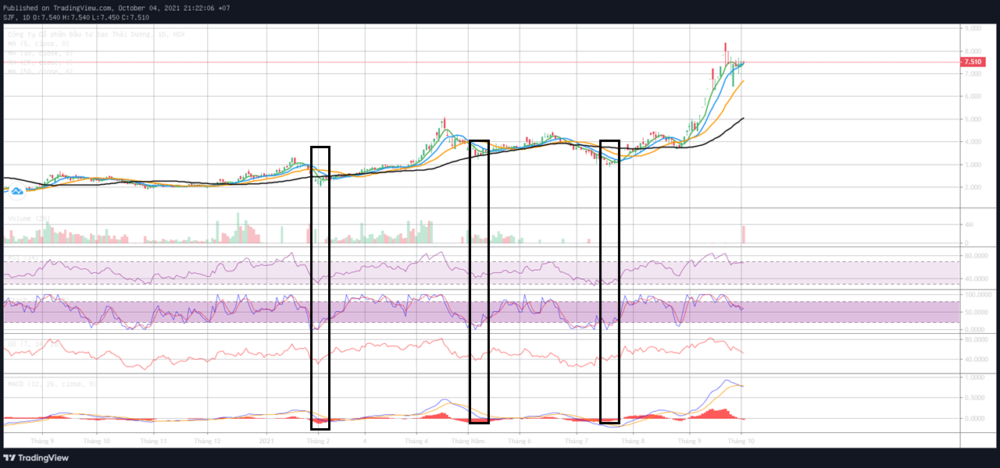
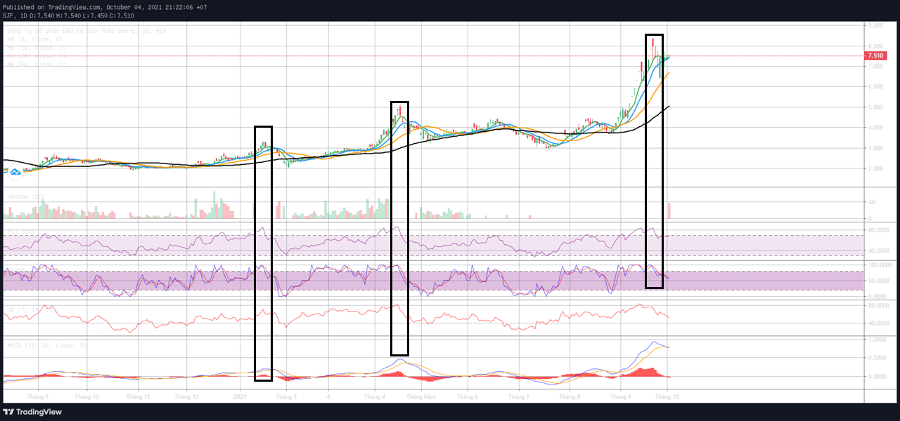
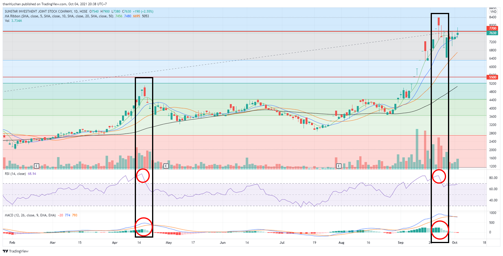

 
<h1>SJF</h1>

 Watch list - 4/10/2021 

[TOC]

## 1. Thông tin cơ bản

- Sàn: Hose
- Ngành: Nông nghiệp (tre ép nông nghiệp, Sản xuất nông nghiệp công nghệ sinh học Nhật Bản)
- Tình trạng: Diện cảnh báo do lợi nhuận âm

## 2. Chỉ số sử dụng

- Đo fibbo, hỗ trợ, kháng cự
- Stoch quá bán & quá mua
- RSI quá bán
- MA: 5, 10, 20, 50 --> MA 20 làm đường hỗ trợ/kháng cự khá tốt cho đồ ngày 1D, MA 50 làm đường hỗ trợ/kháng cự khá tốt cho đồ thị 1H
- MACD (yếu), thường bị bán trễ 1 nửa đoạn đường

## 3. Chiến lược (Hiện khá ngắn hạn)

### **Mua**

Thường đường MA sẽ sớm hơn MACD. Con này đánh dài hạn nên điểm mua thường là sẽ ở ngay hỗ trợ (có thể tham khảo đường MA 20 hoặc MA 50) + Dấu hiệu oversell của Stoch. Không nên mua nếu giá dưới MA 20.

- **Stoch bị quá bán, thường Stock báo sớm hơn đáy 1 xíu**
- **Dấu hiệu mua RSI, Stoch**
- Giá thường nằm dưới tất cả đường MA
- MA5 cắt MA20 (trễ)

 Thật ra ngay lúc Stoch bị quá bán thì đã có dấu hiệu mua rồi, tuy nhiên sẽ bị giật lắc nên tốt nhất là chỉ mua khi giá nằm trên MA 50 & MA 20 

### **Bán** 

- **RSI & Stoch bị quá mua**
- **Dấu hiệu bán với RSI hoặc Stoch**
- **Giá đóng cửa nằm phía dưới đường MA 20**
- Thường sẽ bị bán trễ --> kiểm trả 1-2 cây nến có giá cao nhất phía trước có khối lượng tương đối lớn không, nếu phải thì nến đó là đỉnh, phải bán ngay  
- Thường thì nến ở đỉnh có khối lượng thấp hơn các cây trước

## 4. Action hiện tại (4/10/2021)

- HT: 5.5K
- KC: 7.7K
- Quan sát tiếp, chờ hồi về ít nhất 6.4K & có quá bán mới nên mua

